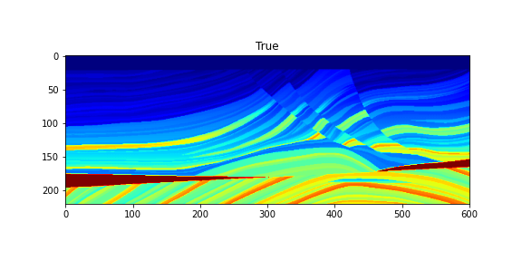
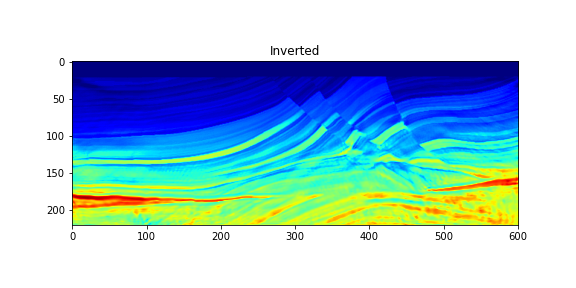

# Assignment 1 
In this assignment, we will run FWI on the Marmousi model given below: 

 

The marmousi model is provided in the file **Marm.bin**

Use the notebook to perform the following tasks 

Tasks:  
1. Running the notebook without any modification should yield the following inversion result

 

Try to improve the inversion result by applying a slight smoothing to the gradient. 

2. Apply the inversion using different initial model (i.e. different smoothing) and observe the convergence.   
3. Filter out frequencies below 5 Hz and observe the convergence 

For each of the above tasks, explain your observation and the reason for the convergence behavior.  

You can submit your answers in a normal pdf report or using the jupyter notebook in a pdf format but you have to answer the question using Markdown mode.   
