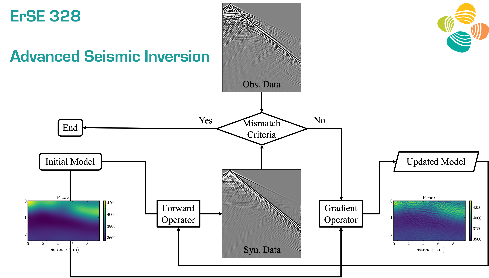

This repo contains materials for the course ErSE328 Advanced Seismic Inversion course taught by Professor Tariq Alkhalifah in King Abdullah University of Science. An inversion example is shown below:

# Getting started :space_invader: :robot:

Throughout the computational part of the course, we will mainly be utilizing the Deepwave Python library which you can access from their [repository](https://git@github.com:alaliaa/ErSE328-AdvancedSeismicInversion.git). To get yourself started, you can directly learn the Deepwave fundamentals from their [documentations](https://ausargeo.com/deepwave/).

To install the environment, run the following command:
```
./install_env.sh
```
It will take some time, but if, in the end, you see the word `Done!` on your terminal, you are ready to go. 

Remember to always activate the environment by typing:
```
conda activate erse328asi
```

# Assignments 
Assignment #  | Due date     | Objectives
------------- | -------------| ------------
[Assignment 0](./00_introduction) | TBD | Ensure the Deepwave package is installed properly.
